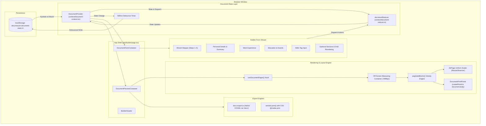
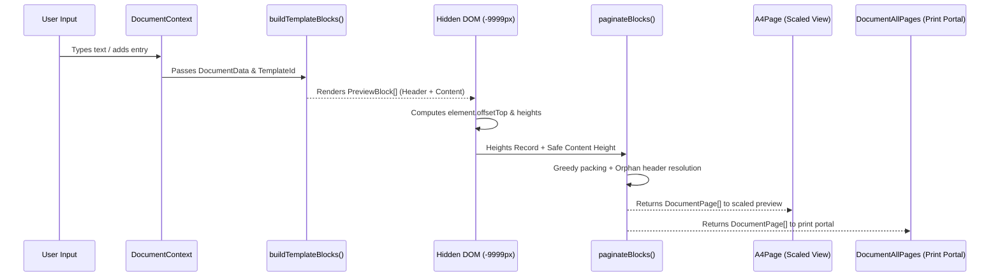

# Documaxxer — System Architecture

This document details the architectural layers, data flow, rendering pipeline, and state synchronization within Documaxxer.

---

## 1. High-Level Component Architecture



---

## 2. State Management & Persistence Pipeline

The application state is entirely managed by React Context and `useReducer`, centralized in [`context/document-context.tsx`](file:///e:/Github/Documaxxer/context/document-context.tsx) and [`context/document-reducer.ts`](file:///e:/Github/Documaxxer/context/document-reducer.ts).

### State Contract (`DocumentState`)
```typescript
export interface DocumentState {
  documentType: "resume" | "cv";
  document: DocumentData;
  activeSection: string | null;     // Stored as step index string ("0" to "4")
  selectedTemplateId: string | null; // e.g. "ats-classic", "modern-tech", "executive"
  selectedFontId: string | null;     // e.g. "calibri", "arial", "times"
  generateUnlocked: boolean;        // Becomes true when step 5 is completed
}
```

### Persistence & Hydration Lifecycle
1. **Initial Mount**:
   - [`DocumentProvider`](file:///e:/Github/Documaxxer/context/document-context.tsx) initializes with defaults (`initialDocumentState`).
   - A client-only `useEffect` reads `localStorage.getItem("documaxxer:document-state:v1")`.
   - Backward compatibility: Checks both `saved.document` and legacy `saved.resume`.
   - Dispatches initial payload (`SET_DOCUMENT`, `SET_TEMPLATE`, `SET_FONT`, `SET_ACTIVE_SECTION`, `SET_DOCUMENT_TYPE`).
   - Sets `isHydrated = true`.
2. **Debounced Autosave**:
   - A reactive `useEffect` tracks changes to `state`.
   - When `state` mutates, any pending timeout is cleared via `saveTimeout.current`.
   - A `setTimeout(..., 500)` schedules a write to `localStorage`.
   - Wrapped in a `try/catch` to gracefully degrade if quota limits or private browsing block storage.

---

## 3. Builder Form Wizard Flow

The builder form is implemented in [`DocumentFormContainer`](file:///e:/Github/Documaxxer/components/builder/form/document-form-container.tsx).

```
Step 1: Personal Details & Summary (Required: Name, Email, Phone, Location)
  │
  ▼
Step 2: Work Experience (Optional; validation requires complete dates/role if entry added)
  │
  ▼
Step 3: Education (Required: At least 1 entry; School, Degree, Field of Study, Dates)
  │
  ▼
Step 4: Skills (Required: At least 1 skill chip)
  │
  ▼
Step 5: Additional Dynamic Sections (15+ section types, drag-and-drop ordering)
  │
  ▼
Unlock Document Generation & Export
```

### Navigation & Validation Rules
- **Backward Navigation**: Completely unrestricted. Users can jump back to any previously visited step via step chips.
- **Forward Navigation**: Blocked until all validation checks for the active step pass (`invalidStep()` guard). If validation fails, error badges and inline indicators display (`showErrors = true`).
- **Section Reordering**: Optional sections in Step 5 utilize standard HTML5 Drag-and-Drop (`dragIndex`, `onDragStart`, `onDragOver`, `onDrop`) to dispatch updated `SET_OPTIONAL_SECTIONS` arrays.

---

## 4. Real-Time Layout & Pagination Engine

The live preview and print views share a unified rendering pipeline implemented in [`useDocumentPages()`](file:///e:/Github/Documaxxer/components/builder/preview/document-preview.tsx) and [`document-blocks.tsx`](file:///e:/Github/Documaxxer/lib/documents/document-blocks.tsx).

### A4 Dimensions & Column Metrics
- **A4 Physical Size**: 210mm × 297mm
- **Margins**: 25.4mm (1.0 inch) on all 4 sides
- **Content Area**: 159.2mm width × 246.2mm height
- **2-Column Template Layout (Executive / Modern Tech)**:
  - Sidebar Rail: 35% width minus gap
  - Main Column: 65% width minus gap
  - Inter-column Gap: 8.0mm

### The 4-Phase Rendering Pipeline



1. **Block Assembly (`buildTemplateBlocks`)**:
   Converts structured form state into discrete `PreviewBlock` objects, tagging each as `"header"` or `"content"`.
2. **Hidden DOM Measurement**:
   Blocks are rendered into an off-screen container (`left: -9999px`) at the exact millimeter content width, matching the active font stack and typography tokens. Element heights are extracted using `child.offsetTop` differences.
3. **Greedy Pagination (`paginateBlocks`)**:
   - Iterates through blocks, accumulating height.
   - When `usedHeight + blockHeight > contentHeight - 3px`, a new page is allocated.
   - **Orphan-Header Resolution**: If a page ends with a block of type `"header"`, the algorithm pops the header and pushes it to the top of the next page. Cascading checks ensure moving headers does not cause secondary overflows.
4. **Dual Presentation**:
   - **Scaled Interactive Preview (`A4Page`)**: Uses a `ResizeObserver` on the wrapper box to compute a uniform scale factor (`Math.min(widthScale, heightScale)`), rendering exactly 1 A4 page at a time with smooth page navigation buttons.
   - **Full-Fidelity Print Portal (`DocumentPrintPortal`)**: Uses `ReactDOM.createPortal` to render `DocumentAllPages` directly to `document.body` with `@media print` CSS. When the user prints or exports to PDF, the browser prints these exact pages at 100% scale.

---

## 5. Export Architecture

Documaxxer offers two distinct, high-fidelity export mechanisms:

### A. Print-Based PDF Export
- **Trigger**: `window.print()` from [`generate-button.tsx`](file:///e:/Github/Documaxxer/components/builder/preview/generate-button.tsx).
- **Styling Rules**: Defined in [`styles/globals.css`](file:///e:/Github/Documaxxer/styles/globals.css) under `@media print`.
- **Properties**:
  - `@page { size: A4; margin: 0; }`
  - Browser UI, navigation bars, glassmorphism shells, and builder controls are hidden.
  - The `.print-only` container renders all pages sequentially with CSS `page-break-after: always`.
  - All text is forced to exact high-contrast `#000000`.

### B. Native OOXML DOCX Export
- **Generator**: [`exportDocumentToDocx()`](file:///e:/Github/Documaxxer/lib/export/docx-export.ts) using the `docx` library.
- **Mechanism**: Builds genuine Microsoft Word OpenXML objects (`Document`, `Paragraph`, `TextRun`, `TabStop`).
- **Typography Alignment**:
  - Shared point sizes converted to half-points (`hp = pt * 2`).
  - Pixel margins converted to twips (`1 px = 15 twips`).
  - Right-aligned dates handled via native Word tab stops (`TabStopType.RIGHT`, `TabStopPosition.MAX`).
  - Output is packaged as a binary Blob via `Packer.toBlob()` and downloaded natively. No server or headless browser required.
