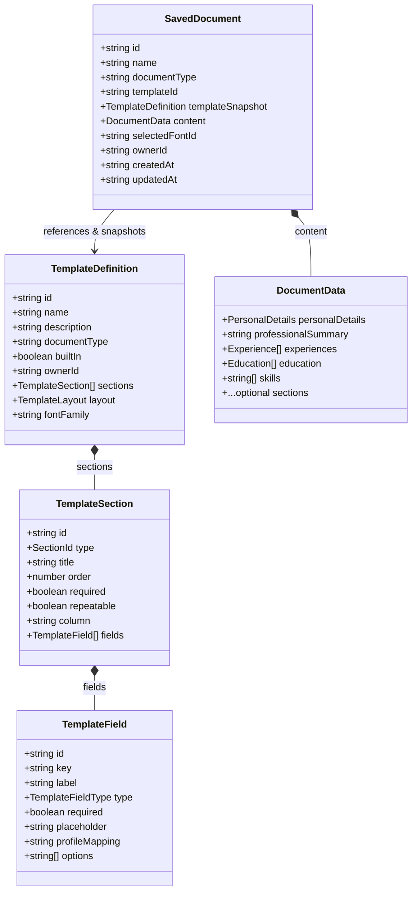

# Documaxxer — Document Data Model & Reducer Actions

This document is the authoritative specification for all data types, document interfaces, state shapes, and state actions in Documaxxer. All definitions reflect [`types/document.ts`](file:///e:/Github/Documaxxer/types/document.ts) and [`context/document-reducer.ts`](file:///e:/Github/Documaxxer/context/document-reducer.ts).

---

## 1. Core State Shapes

### `DocumentState`
The root state container held in React Context:
```typescript
export interface DocumentState {
  documentType: "resume" | "cv";
  document: DocumentData;
  activeSection: string | null;      // Stored as step index string ("0" to "4")
  selectedTemplateId: string | null;  // e.g. "ats-classic", "modern-tech", "executive"
  selectedFontId: string | null;      // e.g. "calibri", "arial", "times", etc.
  generateUnlocked: boolean;         // True after completing Step 5
}
```

### `DocumentData`
Contains all user-entered content for a single document:
```typescript
export interface DocumentData {
  personalDetails: PersonalDetails;
  professionalSummary: string;
  experiences: Experience[];
  education: Education[];
  skills: string[];
  projects: Project[];
  certifications: Certification[];
  languages: Language[];
  awards: Award[];
  volunteerExperiences: VolunteerExperience[];
  publications: Publication[];
  presentations: Presentation[];
  researchExperiences: ResearchExperience[];
  teachingExperiences: TeachingExperience[];
  grants: Grant[];
  memberships: Membership[];
  organizations: OrganizationRole[];
  leadership: LeadershipExperience[];
  references: Reference[];
  otherEntries: OtherEntry[];
  optionalSections: OptionalSectionKey[];
  sectionTitles: Record<SectionId, string>;
}
```

---

## 2. Core Section Data Interfaces

### Personal Details & Contact
```typescript
export interface ContactDetails {
  email: string;
  phoneCountry: string; // e.g. "PH"
  phoneNumber: string;  // e.g. "0917 123 4567"
  location: string;     // e.g. "Cebu City, Philippines"
}

export interface ResumeLink {
  id: string;
  name: string; // e.g. "LinkedIn", "GitHub", "Portfolio"
  url: string;  // e.g. "https://linkedin.com/in/johndoe"
}

export interface PersonalDetails {
  firstName: string;
  lastName: string;
  headline: string;
  contact: ContactDetails;
  links: ResumeLink[];
}
```

### Experience & Education
```typescript
export interface Experience {
  id: string;
  employer: string;
  role: string;
  location: string;
  startDate: string;      // YYYY-MM or YYYY
  endDate: string;        // YYYY-MM or YYYY
  current: boolean;       // If true, endDate is ignored and displayed as "Present"
  highlights: string[];   // Array of bullet items
}

export interface EducationAward {
  id: string;
  name: string;           // e.g. "Dean's Lister", "Cum Laude"
}

export interface Education {
  id: string;
  educationType: "college" | "highSchool";
  institution: string;
  degree: string;
  fieldOfStudy: string;
  location: string;
  startDate: string;
  endDate: string;
  current: boolean;
  awards: EducationAward[];
  gradeLabel?: string;    // e.g. "GPA", "GWA"
  gradeValue?: string;    // e.g. "3.85", "1.25"
}
```

---

## 3. Dynamic Optional Sections (15 Types)

Documaxxer supports 15 dynamic section types declared in `OptionalSectionKey`:

```typescript
export type OptionalSectionKey =
  | "projects"
  | "certifications"
  | "awards"
  | "volunteerExperiences"
  | "languages"
  | "publications"
  | "presentations"
  | "researchExperiences"
  | "teachingExperiences"
  | "grants"
  | "memberships"
  | "organizations"
  | "leadership"
  | "references"
  | "other";

export type SectionId =
  | "personal"
  | "summary"
  | "experience"
  | "education"
  | "skills"
  | OptionalSectionKey;
```

### Dynamic Section Data Models
```typescript
export interface Project {
  id: string;
  name: string;
  date: string;
  technologies: string[];
  highlights: string[];
}

export interface Certification {
  id: string;
  name: string;
  issuingOrganization?: string;
  date: string;
}

export interface Language {
  id: string;
  name: string;
  proficiency: string; // e.g. "Native", "Fluent", "Conversational"
}

export interface Award {
  id: string;
  title: string;
  date: string;
  highlights: string[];
}

export interface VolunteerExperience {
  id: string;
  organization: string;
  role: string;
  date: string;
  highlights: string[];
}

export interface Publication {
  id: string;
  title: string;
  authors: string;
  publisher: string;
  date: string;
  url: string;
  highlights: string[];
}

export interface Presentation {
  id: string;
  title: string;
  event: string;
  location: string;
  date: string;
  highlights: string[];
}

export interface ResearchExperience {
  id: string;
  role: string;
  organization: string;
  project: string;
  date: string;
  highlights: string[];
}

export interface TeachingExperience {
  id: string;
  role: string;
  institution: string;
  location: string;
  date: string;
  highlights: string[];
}

export interface Grant {
  id: string;
  name: string;
  issuer: string;
  date: string;
  highlights: string[];
}

export interface Membership {
  id: string;
  organization: string;
  role: string;
  date: string;
  highlights: string[];
}

export interface OrganizationRole {
  id: string;
  organization: string;
  role: string;
  date: string;
  highlights: string[];
}

export interface LeadershipExperience {
  id: string;
  role: string;
  organization: string;
  date: string;
  highlights: string[];
}

export interface Reference {
  id: string;
  name: string;
  title: string;
  company: string;
  contactInfo: string;
}

export interface OtherEntry {
  id: string;
  name: string;
  date: string;
  highlights: string[];
}
```

---

## 4. Reducer Actions (`DocumentAction`)

[`documentReducer`](file:///e:/Github/Documaxxer/context/document-reducer.ts) manages 29 discrete action types:

| Action Type | Payload Type | Description |
| :--- | :--- | :--- |
| `SET_DOCUMENT` | `DocumentData` | Overwrites entire document data (used during hydration). |
| `SET_ACTIVE_SECTION` | `string \| null` | Updates active wizard step (e.g. `"0"`, `"1"`, etc.). |
| `SET_TEMPLATE` | `string \| null` | Selects the active template ID. |
| `SET_FONT` | `string \| null` | Selects the active typography font ID. |
| `UPDATE_PERSONAL_DETAILS` | `PersonalDetails` | Updates personal contact information and web links. |
| `SET_PROFESSIONAL_SUMMARY` | `string` | Sets the professional summary or objective text. |
| `SET_EXPERIENCES` | `Experience[]` | Replaces work experience entries. |
| `SET_EDUCATION` | `Education[]` | Replaces education records. |
| `SET_SKILLS` | `string[]` | Replaces the list of skill tags. |
| `SET_PROJECTS` | `Project[]` | Replaces project entries. |
| `SET_CERTIFICATIONS` | `Certification[]` | Replaces certification entries. |
| `SET_AWARDS` | `Award[]` | Replaces awards & honors. |
| `SET_VOLUNTEER_EXPERIENCES`| `VolunteerExperience[]`| Replaces volunteer records. |
| `SET_LANGUAGES` | `Language[]` | Replaces spoken/programming languages. |
| `SET_PUBLICATIONS` | `Publication[]` | Replaces publication records. |
| `SET_PRESENTATIONS` | `Presentation[]` | Replaces presentation/conference talks. |
| `SET_RESEARCH_EXPERIENCES` | `ResearchExperience[]` | Replaces research experience records. |
| `SET_TEACHING_EXPERIENCES` | `TeachingExperience[]` | Replaces academic teaching appointments. |
| `SET_GRANTS` | `Grant[]` | Replaces grants, scholarships, or fellowships. |
| `SET_MEMBERSHIPS` | `Membership[]` | Replaces professional society memberships. |
| `SET_ORGANIZATIONS` | `OrganizationRole[]` | Replaces student or professional organizations. |
| `SET_LEADERSHIP` | `LeadershipExperience[]` | Replaces dedicated leadership roles. |
| `SET_REFERENCES` | `Reference[]` | Replaces academic/professional references. |
| `SET_OTHER_ENTRIES` | `OtherEntry[]` | Replaces custom other section entries. |
| `SET_OPTIONAL_SECTIONS` | `OptionalSectionKey[]` | Replaces list and order of active optional sections. |
| `SET_SECTION_TITLE` | `{ id: SectionId; title: string }` | Overrides custom heading label for a section. |
| `SET_DOCUMENT_TYPE` | `"resume" \| "cv"` | Toggles document mode between Resume and CV. |
| `UNLOCK_GENERATE` | *none* | Sets `generateUnlocked: true` to reveal export button. |
| `RESET_DOCUMENT` | *none* | Restores state to `initialDocumentState`. |

---

## 5. Section Titles & Initial State

### Default Titles
Defined in [`DEFAULT_SECTION_TITLES`](file:///e:/Github/Documaxxer/context/document-reducer.ts#L5-L26):
```typescript
export const DEFAULT_SECTION_TITLES: Record<SectionId, string> = {
  personal: "Personal Information",
  summary: "Professional Summary",
  experience: "Work Experience",
  education: "Education",
  skills: "Skills",
  projects: "Projects",
  certifications: "Certifications",
  awards: "Awards",
  volunteerExperiences: "Volunteer Experience",
  languages: "Languages",
  publications: "Publications",
  presentations: "Presentations",
  researchExperiences: "Research Experience",
  teachingExperiences: "Teaching Experience",
  grants: "Grants & Fellowships",
  memberships: "Professional Memberships",
  organizations: "Organizations",
  leadership: "Leadership",
  references: "References",
  other: "Other",
};
```

### Initial State Defaults
- **Country**: `"PH"`
- **Template**: `"ats-classic"`
- **Font**: `"calibri"`
- **Document Type**: `"resume"`
- **Generate Unlocked**: `false`

---

## 6. Template Definition & Saved Document Schema (Milestone 2)

Milestone 2 establishes a clear architectural separation between **Structure (Templates)** and **Content (Saved Documents)**:

- **`TemplateDefinition`** specifies the *structure* — sections, fields, types, ordering, constraints, and layout.
- **`SavedDocument`** holds an *instance* — the user's actual document data (`content: DocumentData`), font choice, and ownership metadata.
- **`DocumentData`** continues to represent the raw user data stored in the instance.



### Template Schemas ([`types/template.ts`](file:///e:/Github/Documaxxer/types/template.ts))

#### `TemplateFieldType`
Supported input types for form fields:
```typescript
export type TemplateFieldType =
  | "text"
  | "textarea"
  | "email"
  | "phone"
  | "date"
  | "url"
  | "number"
  | "select"
  | "multiselect"
  | "list"
  | "rich-text";
```

#### `TemplateField`
Defines an individual input field within a template section:
```typescript
export interface TemplateField {
  id: string;               // Unique field ID within the section
  key: string;              // Maps to property in DocumentData entry (e.g. "employer", "role")
  label: string;            // Form field label
  type: TemplateFieldType;  // Input control type
  required: boolean;        // Mandatory validation flag
  placeholder?: string;     // Input placeholder
  profileMapping?: string;  // Target key for M8 autofill (e.g. "profile.firstName")
  options?: string[];       // Select / multiselect options
}
```

#### `TemplateSection`
Defines a document section containing a set of fields:
```typescript
export interface TemplateSection {
  id: string;                    // Unique section ID
  type: SectionId;               // Maps to SectionId union (determines data model & reducer action)
  title: string;                 // Default section heading
  order: number;                 // 0-based display order
  required: boolean;             // Whether section must contain at least 1 entry
  fields: TemplateField[];       // Input fields for each entry
  repeatable?: boolean;          // Whether multiple entries can be added (e.g. multiple jobs)
  column?: "main" | "rail";      // Column placement for 2-column layouts
}
```

#### `TemplateLayout`
Specifies structural layout parameters:
```typescript
export interface TemplateLayout {
  columns: 1 | 2;                     // 1 = single column, 2 = main + sidebar
  headerAlignment: "left" | "center"; // Header and name alignment
  sidebarRatio?: number;              // Width ratio for main column (e.g. 0.65)
}
```

#### `TemplateDefinition`
The complete blueprint for a document type:
```typescript
export interface TemplateDefinition {
  id: string;
  name: string;
  description: string;
  documentType: "resume" | "cv" | "cover-letter";
  builtIn: boolean;                  // true for code-defined templates, false for user-created
  ownerId?: string;                  // User ID for custom templates (undefined for built-in)
  sections: TemplateSection[];       // Ordered section schemas
  layout: TemplateLayout;            // Layout configuration
  fontFamily?: string;               // Optional default font override
  createdAt: string;                 // ISO date-time
  updatedAt: string;                 // ISO date-time
}
```

### Saved Document Schema ([`types/saved-document.ts`](file:///e:/Github/Documaxxer/types/saved-document.ts))

#### `SavedDocument`
Represents a user's persistent document instance:
```typescript
export interface SavedDocument {
  id: string;                                    // Unique document ID
  name: string;                                  // Document title (e.g. "Google Application Resume")
  documentType: "resume" | "cv" | "cover-letter";
  templateId: string;                            // Reference to parent TemplateDefinition
  templateSnapshot?: TemplateDefinition;         // Freeze of template at creation time (M11)
  content: DocumentData;                         // Actual user data
  selectedFontId: string | null;                 // Selected typography font ID
  ownerId?: string;                              // Owner user ID (M3+ authentication)
  createdAt: string;                             // ISO date-time
  updatedAt: string;                             // ISO date-time
}
```

### Relationship to `DocumentData`
1. **Separation of Structure vs. Content**: `TemplateDefinition` declares *what* data fields are collected and how they are displayed, while `DocumentData` contains the *actual values* entered by the user.
2. **Key Mapping**: `TemplateField.key` corresponds directly to property keys in `DocumentData` models (e.g. `Experience.employer`, `Education.degree`, `ContactDetails.email`).
3. **Section Routing**: `TemplateSection.type` links to `SectionId`, determining which array/object in `DocumentData` stores the section's records.
4. **Snapshot Safety (M11)**: When a document is created, `templateSnapshot` preserves the `TemplateDefinition` state, ensuring that subsequent template updates never alter or corrupt existing documents.
