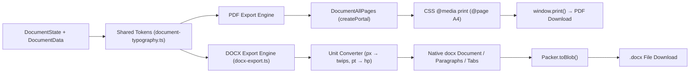

# Documaxxer — Export System & Document Parity

This document describes the dual export pipeline in Documaxxer: **Native DOCX Generation** via the `docx` library and **Clean Print-Based PDF Generation** via the browser print engine, along with the shared typography tokens and unit conversions connecting them.

---

## 1. Export Architecture Overview

Documaxxer supports two export formats directly within the client browser without external server processing or cloud rendering services:



---

## 2. Print-Based PDF Export Pipeline

PDF export is triggered via the [`GenerateButton`](file:///e:/Github/Documaxxer/components/builder/preview/generate-button.tsx) component:

### Implementation Details
1. **Print Portal Mounting**:
   [`DocumentPrintPortal`](file:///e:/Github/Documaxxer/components/builder/preview/document-preview-container.tsx) uses `ReactDOM.createPortal` to attach the [`DocumentAllPages`](file:///e:/Github/Documaxxer/components/builder/preview/document-preview.tsx#L409) component directly to `document.body`.
2. **Identical Pagination**:
   `DocumentAllPages` consumes the exact same [`useDocumentPages()`](file:///e:/Github/Documaxxer/components/builder/preview/document-preview.tsx#L62) hook calculation as the interactive preview. Blocks are divided across pages using identical measurements.
3. **Print Media CSS Rules**:
   Defined in [`styles/globals.css`](file:///e:/Github/Documaxxer/styles/globals.css#L92-L120):
   ```css
   @media print {
     @page {
       size: A4;
       margin: 0;
     }
     html, body {
       background: #ffffff !important;
       margin: 0 !important;
       padding: 0 !important;
     }
     .print-only, .print-only * {
       -webkit-print-color-adjust: exact;
       print-color-adjust: exact;
     }
     .print-only h2, .print-only h3, .print-only p,
     .print-only li, .print-only span, .print-only a {
       color: #000000 !important;
     }
     .print-only [style*="border"], .print-only h3, .print-only header {
       border-color: #000000 !important;
     }
   }
   ```
4. **UI Chrome Suppression**:
   In print mode, all application headers, buttons, form controls, and theme containers are hidden (`hidden print:block` on `.print-only`), ensuring only pure A4 paper sheets are printed.

---

## 3. Native OOXML DOCX Export Pipeline

DOCX export is implemented in [`lib/export/docx-export.ts`](file:///e:/Github/Documaxxer/lib/export/docx-export.ts) using the `docx` library (v9.7.1).

### Key Architectural Traits
- **Genuinely Editable**: Generates real Microsoft Word OpenXML objects (`Document`, `Paragraph`, `TextRun`, `TabStop`).
- **No Screenshots or HTML Hacks**: Does NOT export images or web views wrapped in `.docx` containers.
- **Client-Side Binary Packing**: Packages OOXML into a binary buffer in the browser using `Packer.toBlob(doc)` and downloads via an invisible DOM anchor (`<a>`).

### OOXML Structure Mapping

| Document Element | Preview CSS Representation | Native DOCX Implementation |
| :--- | :--- | :--- |
| **Page Size** | 210mm × 297mm | `convertMillimetersToTwip(210)` × `convertMillimetersToTwip(297)` |
| **Page Margins** | 25.4mm (1.0 inch) | `convertMillimetersToTwip(25.4)` on all sides |
| **Candidate Name** | `fontSize: "22pt"`, bold | `Paragraph` with `TextRun(size: NAME_HP, bold: true)` |
| **Section Headings**| `fontSize: "11pt"`, uppercase, bottom border | `Paragraph` with `border: { bottom: { style: BorderStyle.SINGLE } }` |
| **Dates & Location**| Flex container `justifyContent: "space-between"` | `Paragraph` with `tabStops: [{ type: TabStopType.RIGHT, position: TabStopPosition.MAX }]` |
| **Bullet Points** | `<ul><li>` list items | `Paragraph` with `bullet: { level: 0 }` |

---

## 4. Shared Typography & Unit Conversion

To ensure visual parity, DOCX generation shares the typography constants in [`lib/documents/document-typography.ts`](file:///e:/Github/Documaxxer/lib/documents/document-typography.ts):

### Typographic Points vs Half-Points (hp)
OpenXML specifies font sizes in **half-points** (`1 pt = 2 hp`):
- `NAME_PT = 22` → `NAME_HP = 44`
- `SECTION_HEADING_PT = 11` → `SECTION_HEADING_HP = 22`
- `ENTRY_TITLE_PT = 10` → `ENTRY_TITLE_HP = 20`
- `BODY_PT = 10` → `BODY_HP = 20`
- `CONTACT_PT = 10` → `CONTACT_HP = 20`
- `DATE_PT = 10` → `DATE_HP = 20`

### CSS Pixels to Twips Conversion
A **twip** is a twentieth of an imperial point (`1/1440` of an inch). At standard 96 DPI CSS rendering:
- `1 inch = 96 CSS-px = 1440 twips` → **`1 CSS-px = 15 twips`** (`PX_TO_TWIP = 15`)

Spacing conversions:
- **Heading Top Margin**: `14px * 15 = 210 twips` (`SECTION_HEADING_BEFORE`)
- **Heading Bottom Padding**: `4px * 15 = 60 twips` (`SECTION_HEADING_AFTER`)
- **Entry Top Margin**: `8px * 15 = 120 twips` (`ENTRY_BEFORE`)
- **Bullet Margin Bottom**: `2px * 15 = 30 twips` (`BULLET_AFTER`)
- **Body Line Height (1.5×)**: `Math.round(10pt * 20 twips * 1.5) = 300 twips` (`BODY_LINE_SPACING`)

---

## 5. Parity Status & Known Discrepancies (Milestone 10)

| Feature / Attribute | Preview Canvas | PDF (Print) | Native DOCX | Parity Status |
| :--- | :--- | :--- | :--- | :--- |
| **Text Content** | Identical | Identical | Identical | ✅ 1:1 Match |
| **Font Family** | Exact CSS Stack | Exact CSS Stack | First resolved font name | ✅ 1:1 Match |
| **Font Sizing** | Point (pt) sizes | Point (pt) sizes | Exact half-points (hp) | ✅ 1:1 Match |
| **Text Color** | Pure Black (`#000`) | Forced Black (`#000`)| Pure Black (`000000`) | ✅ 1:1 Match |
| **Section Borders** | 1px solid black | 1px solid black | `BorderStyle.SINGLE, size: 4` | ✅ 1:1 Match |
| **Dates Alignment** | Flexbox Right | Flexbox Right | Max Right Tab Stop (`\t`) | ✅ 1:1 Match |
| **Single Column Flow**| Greedy Paginated | Greedy Paginated | Native Word Flow | ✅ 1:1 Match |
| **Two-Column Sidebar**| 65% / 35% Grid | 65% / 35% Grid | Linear single-column flow | ⚠️ Discrepancy (DOCX Table needed) |
| **Page Break Exactness**| DOM measured | Exact to Preview | Dependent on Word engine | ⚠️ Minor variations |
