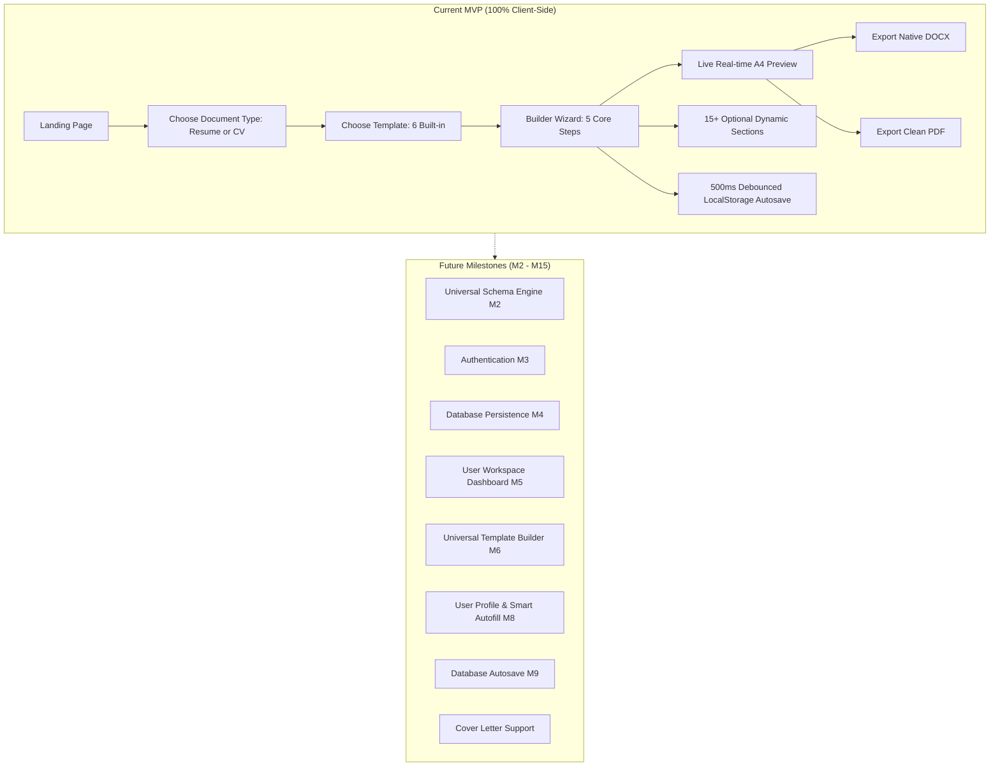

# Documaxxer — Project Overview

## 1. Executive Summary

**Documaxxer** is a modern, high-performance document builder designed specifically for creating Resumes, Curriculum Vitae (CVs), and Cover Letters with genuine formatting integrity.

- **Application Name**: Documaxxer (*"Document + Max + -er"* → *"Max your documents"*)
- **Package Name**: `resume-builder` (defined in [`package.json`](file:///e:/Github/Documaxxer/package.json))
- **Primary Mission**: Help job seekers, students, and professionals create crisp, ATS-friendly career documents with real-time A4 preview and native editable DOCX / PDF export.
- **Current Architectural Phase**: 100% Client-Side MVP with debounced `localStorage` autosave. No mandatory login or backend required to build or export documents.

---

## 2. Product Positioning & Philosophy

### Target Audience
Documaxxer is tailored primarily for the **Philippine job market and academic landscape**, while remaining broadly compatible worldwide:
1. **College & University Students**: Preparing for internship programs (OJT), student leadership, and academic fellowships.
2. **Fresh Graduates**: Needing clear guidance, academic award integration, and project-based portfolios to compensate for limited work history.
3. **Entry-Level Job Seekers & Career Shifters**: Highlighting transferable skills and tailored experience.
4. **Experienced Professionals**: Crafting executive 2-column or comprehensive academic/research CVs.

### Dual Design Philosophy
- **App Shell UI**: Energetic, modern, and engaging. Employs subtle glassmorphism (`backdrop-blur-xl`), smooth micro-interactions, dark/light theme switching, and indigo/blue accents (`#2563EB`). It feels fresh without being childish or meme-heavy.
- **Rendered Document Canvas**: Pure, conservative, and ATS-compliant. Zero glassmorphism, zero gimmicks, crisp high-contrast black text (`#000000`), predictable single- or two-column typography, standard A4 margins, and strict structural layout.

---

## 3. Philippine-Focused Defaults

Documaxxer replaces generic foreign defaults with contextually relevant Philippine examples:
- **Default Country & Dial Code**: Philippines (`+63`, country code `"PH"`).
- **Phone Formatting**: `0917 123 4567` (handled by [`isValidPhoneNumber`](file:///e:/Github/Documaxxer/lib/validation/phone.ts)).
- **Locations**: Cebu City, Metro Manila, Quezon City, Davao City, etc.
- **Education Strands**: Support for Senior High School strands (STEM, ABM, HUMSS, TVL).
- **Academic Honors**: Support for Latin honors (*Cum Laude, Magna Cum Laude*), Dean's Lister, and President's Lister directly on education entries.

> [!IMPORTANT]
> **Placeholders vs Live Data:**
> All Philippine sample details (`John Doe`, `0917 123 4567`, `Cebu City, Philippines`, `john.doe@email.com`) are **placeholders only**. They provide visual guidance in input fields and empty states, but are never injected as actual user data into the document state.

---

## 4. Current Tech Stack

| Layer | Technology | Details |
| :--- | :--- | :--- |
| **Framework** | [Next.js 15](https://nextjs.org/) | App Router architecture, React Server Components where applicable, client-side wizard pages. |
| **Runtime Library** | [React 19](https://react.dev/) | React 19 concurrent features, `useReducer`, `useMemo`, `useCallback`, `useLayoutEffect`. |
| **Language** | [TypeScript 5](https://www.typescriptlang.org/) | Strict type safety across all document schemas, reducer actions, and export structures. |
| **Styling** | [Tailwind CSS v4](https://tailwindcss.com/) | Built with `@import "tailwindcss"`, CSS `@source` directives, and custom `@custom-variant dark`. |
| **State Management** | React Context + `useReducer` | Single client-side source of truth (`DocumentProvider`). No Redux, Zustand, or external stores. |
| **Persistence (MVP)** | `window.localStorage` | Key: `documaxxer:document-state:v1`, debounced at 500ms. |
| **DOCX Generation** | [`docx`](https://docx.js.org/) v9.7.1 | Generates authentic, editable OpenXML Word documents directly in the browser. |
| **PDF Generation** | Native Browser Print Engine | Triggered via `window.print()` using CSS `@media print` rules with true A4 page dimensions. |

---

## 5. Current Scope vs Future Scope

### Supported Document Types in Current MVP
1. **Resume**: Concise 1–2 page career document focusing on experience, education, key technical skills, and projects. Templates: `ats-classic`, `modern-tech`, `executive`.
2. **Curriculum Vitae (CV)**: Comprehensive academic and professional trajectory document with publications, research, presentations, grants, and teaching experience. Templates: `academic`, `research`, `professional`.
3. **Cover Letter**: Marked as *"Coming Soon"* in the UI; deferred to universal schema implementation.
