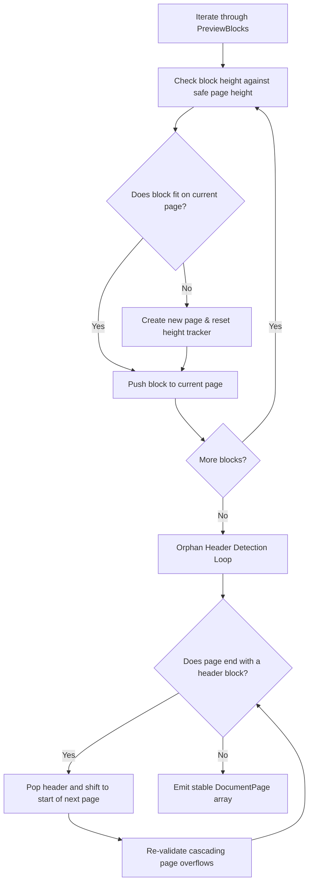

# Documaxxer — Template System & Rendering Engine

This document details the template catalog, theme configurations, layout models, block generation logic, and pagination algorithms that power document rendering in Documaxxer.

---

## 1. The Built-in Template Registry

All templates are declared in [`lib/templates/templates.ts`](file:///e:/Github/Documaxxer/lib/templates/templates.ts) under the `RESUME_TEMPLATES` registry.

| Template ID | Name | Type | Layout Style | Default Font Style | Header Alignment | Target Audience |
| :--- | :--- | :--- | :--- | :--- | :--- | :--- |
| `ats-classic` | **ATS Classic** | Resume | Single Column | Serif (`Georgia`) | Center | Traditional corporate, finance, and ATS scanners. |
| `modern-tech` | **Modern Tech** | Resume | Single Column | Sans-serif (`Segoe UI`) | Left | Software engineering, IT, design, and startups. |
| `executive` | **Executive** | Resume | Two-Column Sidebar | Sans-serif (`Segoe UI`) | Left | Senior leadership, executives, and managers. |
| `academic` | **Academic** | CV | Single Column | Serif (`Georgia`) | Center | Higher education faculty, PhD applicants, scholarships. |
| `research` | **Research** | CV | Single Column | Sans-serif (`Segoe UI`) | Left | R&D scientists, laboratory fellows, engineers. |
| `professional` | **Professional** | CV | Single Column | Sans-serif (`Segoe UI`) | Left | Comprehensive career trajectory and consulting. |

The default fallback template is `ats-classic`.

---

## 2. Template Theme Definitions

Defined in [`lib/documents/document-blocks.tsx`](file:///e:/Github/Documaxxer/lib/documents/document-blocks.tsx#L16-L31):

```typescript
export interface TemplateTheme {
  fontStack: string;
  headerAlign: "left" | "center";
}

const FONT_STACK_SERIF = "Georgia, 'Times New Roman', serif";
const FONT_STACK_SANS = "'Segoe UI', Helvetica, Arial, sans-serif";

export const TEMPLATE_THEMES: Record<TemplateId, TemplateTheme> = {
  "ats-classic": { fontStack: FONT_STACK_SERIF, headerAlign: "center" },
  "modern-tech": { fontStack: FONT_STACK_SANS, headerAlign: "left" },
  executive:     { fontStack: FONT_STACK_SANS, headerAlign: "left" },
  academic:      { fontStack: FONT_STACK_SERIF, headerAlign: "center" },
  research:      { fontStack: FONT_STACK_SANS, headerAlign: "left" },
  professional:  { fontStack: FONT_STACK_SANS, headerAlign: "left" },
};
```

---

## 3. Physical Page Geometry & Grid Ratios

All rendering calculations use standardized metric millimeters:
- **Sheet Dimensions**: A4 Standard (210mm × 297mm).
- **Margins**: 25.4mm (1.0 inch) on all sides.
- **Content Area**:
  - Content Width: `210 - (25.4 * 2) = 159.2 mm`
  - Content Height: `297 - (25.4 * 2) = 246.2 mm`
- **Sidebar Grid (Two-Column Templates)**:
  - `SIDEBAR_MAIN_WIDTH_RATIO = 0.65` (Main column occupies 65% of width)
  - `SIDEBAR_RAIL_WIDTH_RATIO = 0.35` (Sidebar rail occupies 35% of width)
  - `SIDEBAR_GAP_MM = 8 mm` (Inter-column gap)

---

## 4. Block Generation Pipeline (`buildTemplateBlocks`)

The [`buildTemplateBlocks`](file:///e:/Github/Documaxxer/lib/documents/document-blocks.tsx#L81) function takes `DocumentData` and a `TemplateId` and produces an object with two block arrays:
```typescript
export interface PreviewBlock {
  id: string;
  type: "header" | "content";
  node: ReactNode;
}

export function buildTemplateBlocks(
  document: DocumentData,
  templateId: TemplateId
): { main: PreviewBlock[]; rail: PreviewBlock[] }
```

### Layout Rules:
1. **Single-Column Templates** (`ats-classic`, `modern-tech`, `academic`, `research`, `professional`):
   - All blocks (Summary, Experience, Education, Skills, Optional Sections) are appended to `main`.
   - `rail` is returned as empty `[]`.
2. **Two-Column Sidebar Template** (`executive`):
   - Core biographical narrative (Summary, Experience, Education, Projects) goes into `main`.
   - Contact info, Skills, Languages, Certifications, and Memberships are routed into the `rail` (sidebar).

---

## 5. Greedy Pagination & Orphan-Header Prevention

Document content can span multiple pages. Rather than letting the browser unpredictably break elements, [`paginateBlocks`](file:///e:/Github/Documaxxer/lib/documents/document-blocks.tsx#L542) calculates exact A4 sheet boundaries using measured pixel heights.



### Orphan-Header Algorithm:
1. If any page ends with a block of `type: "header"`, the heading would look awkward with no subsequent content beneath it.
2. The algorithm pops the orphan header and prepends it (`unshift`) to the beginning of the next page.
3. If the last page ends with an orphan header, a new page is allocated to receive it.
4. The algorithm performs a cascading pass: shifting headers forward might cause the subsequent page to exceed `safeHeight`. If so, trailing blocks on that page are pushed forward repeatedly until the entire document stabilizes.

---

## 6. Template Selection & Customization UI

Templates can be chosen in two locations:
1. **Catalog Route** (`/templates?type=resume|cv`): Visual card grid with descriptions, badges, and template type filtering before entering the editor.
2. **Preview Toolbar** ([`TemplatePicker`](file:///e:/Github/Documaxxer/components/builder/template-picker.tsx)): Compact selector pinned above the live preview canvas in `/builder`, allowing users to switch templates on the fly without losing entered data.

---

## 7. Data-Driven Template Schemas (Milestone 2: `TEMPLATE_DEFINITIONS`)

In Milestone 0 and 1, templates were defined primarily through lightweight metadata (`ResumeTemplate` with `id`, `name`, `description`, `type`) coupled with hardcoded builder form rendering.

Milestone 2 formalizes templates into fully **data-driven schema objects** defined in [`lib/templates/templates.ts`](file:///e:/Github/Documaxxer/lib/templates/templates.ts) under `TEMPLATE_DEFINITIONS: Record<TemplateId, TemplateDefinition>`.

### Key Differences: Metadata vs. Full Schema

| Capability | Legacy `ResumeTemplate` | New `TemplateDefinition` |
| :--- | :--- | :--- |
| **Identity & Scope** | `id`, `name`, `description`, `type` | `id`, `name`, `description`, `documentType`, `builtIn`, `ownerId` |
| **Section Structure** | Hardcoded in React form containers | Expressed as ordered `TemplateSection[]` arrays |
| **Field Definitions** | Hardcoded JSX input fields | Declarative `TemplateField[]` with types, labels, required flags, and placeholders |
| **Autofill Ready** | Not supported | `profileMapping` keys map fields directly to user profile properties (M8) |
| **Layout Model** | Implicit CSS styles | Explicit `TemplateLayout` (`columns: 1 \| 2`, `headerAlignment`, `sidebarRatio`) |
| **Extensibility** | Code changes required for new templates | Pure data definition; ready for Universal Template Builder (M6) |

### Built-in Schemas in `TEMPLATE_DEFINITIONS`

All 6 built-in templates have explicit schema representations:

1. **`ats-classic`** (Resume): Single-column, center-aligned header, serif typography. Sections: Personal, Summary, Experience, Education, Skills, Projects, Certifications.
2. **`modern-tech`** (Resume): Single-column, left-aligned header, sans-serif typography. Emphasizes Skills, Projects, and Experience with technology tags.
3. **`executive`** (Resume): Two-column layout (`sidebarRatio: 0.65`), left-aligned header. Main column houses Summary, Experience, Education, and Projects; Rail column houses Contact info, Skills, Languages, Certifications, and Memberships.
4. **`academic`** (CV): Single-column, center-aligned header, serif typography. Comprehensive multi-section structure covering Publications, Presentations, Teaching, Research, Grants, and Awards.
5. **`research`** (CV): Single-column, left-aligned header, sans-serif typography. Optimized for lab positions, technical methodologies, Publications, Research Experience, and Grants.
6. **`professional`** (CV): Single-column, left-aligned header, sans-serif typography. Detailed career trajectory covering Work Experience, Leadership, Certifications, Memberships, and References.

### Schema Lookup: `getTemplateDefinition()`

To retrieve a complete template schema by ID:

```typescript
export function getTemplateDefinition(id: string | null | undefined): TemplateDefinition {
  if (id && id in TEMPLATE_DEFINITIONS) {
    return TEMPLATE_DEFINITIONS[id as TemplateId];
  }
  return TEMPLATE_DEFINITIONS[DEFAULT_TEMPLATE_ID];
}
```

- **Safe Fallback**: If an invalid, null, or undefined ID is passed, it safely defaults to `TEMPLATE_DEFINITIONS["ats-classic"]`.
- **Runtime Consistency**: Ensures both the upcoming schema-driven builder and export engines always have access to a valid structural definition.

### Foundation for Downstream Milestones
- **Milestone 3 & 4 (Auth & DB)**: Template schemas are structured to be stored in the database with `builtIn: boolean` and `ownerId?: string`.
- **Milestone 5 (Workspace Dashboard)**: The dashboard reads template definitions to display available blueprints and render document cards.
- **Milestone 6 (Universal Template Builder)**: Users will edit, duplicate, and create `TemplateDefinition` objects directly through a GUI without editing code.
- **Milestone 7 (Template → SavedDocument Flow)**: Instantiating a document will create a `SavedDocument` referencing a `TemplateDefinition` and capturing an immutable snapshot.
